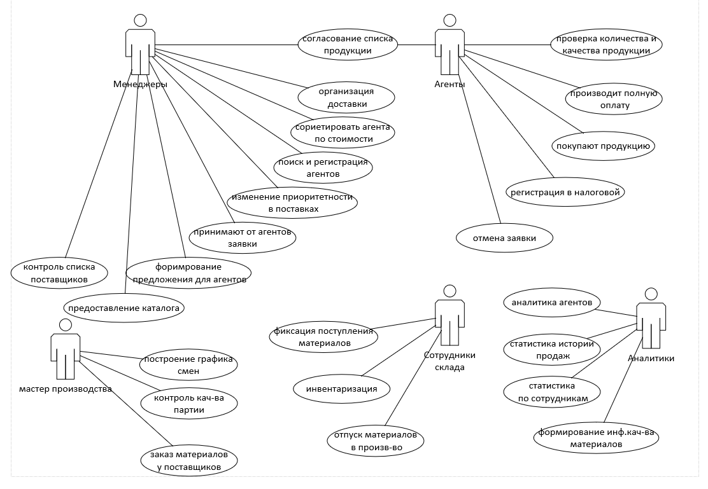

# SQL

## Запрос SQL Material

```sql
insert into Material(Title,MaterialTypeID,CountInPack,Unit,CountInStock,MinCount,Cost)
Select  pk.[Наименование материала],pt.ID,pk.[ Количество в упаковке],pk.[ Единица измерения],pk.[ Количество на складе],pk.[ Минимальный возможный остаток],pk.[ Стоимость]
from
MaterialType pt,
materials_short_k_import pk
where pt.Title=pk.[ Тип материала]
```

## Запрос SQL MaterialType

```sq1
Insert into MaterialType(Title)
select distinct [ Тип материала] from materials_short_k_import
```

## Запрос SQL Product

```sql
insert into [dbo].[Product]([Title],[ProductTypeID],[ArticleNumber],[Image],[ProductionPersonCount],[ProductionWorkshopNumber],[MinCostForAgent])
select [Наименование продукции],PT.ID,[Артикул],[Изображение],[Количество человек для производства],[Номер а для производства],[Минимальная стоимость для агента]
from [dbo].[products_k_import] PAI,
ProductType PT
Where PT.Title=PAI.[Тип продукции]
```

## Запрос SQL ProductMaterial

```sql
insert into [dbo].[ProductMaterial]([ProductID],[MaterialID],Count)
select p.id,m.id,[Необходимое количество материала]


### UseCase

FROM [dbo].[productmaterial_k_import] pm,
Material M,
Product P
Where p.Title=pm.Продукция and m.Title=pm.[Наименование материала]
```

## Запрос SQL ProductType

```sql
insert into  ProductType(Title) 
    select distinct [Тип продукции] from products_k_import
```

### UseCase


